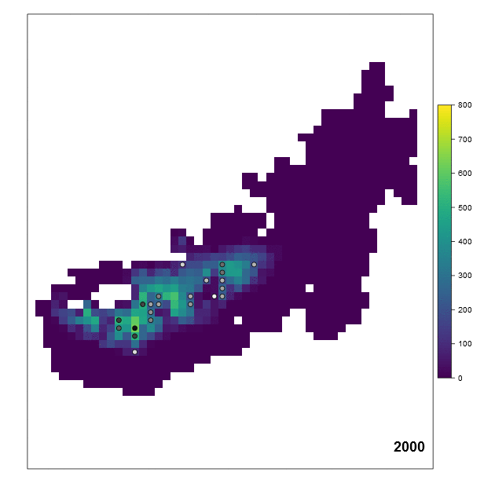

<!-- README.md is generated from README.Rmd. Please edit that file -->
mptools
=======

[](https://travis-ci.org/johnbaums/mptools)

In recent years, spatially-explicit, coupled habitat-demographic models have been developed to acknowledge the importance of population processes when evaluating the impacts of habitat change (Keith *et al.* 2008, 2014; Southwell *et al.* 2008; Fordham *et al.* 2012; Cadenhead *et al.* 2015). Frequently, these coupled models use the Metapop module of RAMAS GIS (Akçakaya & Root 2005) to relate spatially-dynamic habitat suitability to carrying capacity, and then simulate metapopulation dynamics. Metapop saves settings, parameters values, and simulation results to a text file (with .mp extension). Unfortunately, there is limited flexibility within Metapop regarding presentation of results, and extraction of results via the GUI is awkward.

**The `mptools` package provides several useful functions for extracting and processing data from RAMAS Metapop .mp files.**

Function overview:
------------------

<table style="width:39%;">
<colgroup>
<col width="19%" />
<col width="19%" />
</colgroup>
<thead>
<tr class="header">
<th align="left">Function</th>
<th align="left">Description</th>
</tr>
</thead>
<tbody>
<tr class="odd">
<td align="left"><code>actions()</code></td>
<td align="left">Extract management action details from .mp files</td>
</tr>
<tr class="even">
<td align="left"><code>kch()</code></td>
<td align="left">Extract carrying capacity times series from .kch files</td>
</tr>
<tr class="odd">
<td align="left"><code>knt()</code></td>
<td align="left">Plot the carrying capacity and abundance dynamics of one or more populations</td>
</tr>
<tr class="even">
<td align="left"><code>meta()</code></td>
<td align="left">Extract population details from .mp files</td>
</tr>
<tr class="odd">
<td align="left"><code>mp2sp()</code></td>
<td align="left">Create a <code>SpatialPointsDataFrame</code> representing the centroid of each population, with attributes <code>pop</code> (population name), <code>time</code> (the time step), and <code>N</code> (the mean population size)</td>
</tr>
<tr class="even">
<td align="left"><code>mp2xy()</code></td>
<td align="left">Extract coordinates for populations from .mp files, and transform them to the original coordinate reference system</td>
</tr>
<tr class="odd">
<td align="left"><code>mp_animate()</code></td>
<td align="left">Animate temporal habitat and abundance dynamics on a gridded landscape</td>
</tr>
<tr class="even">
<td align="left"><code>results()</code></td>
<td align="left">Extract simulation results (mean, sd, min and max of population size), as well as expected minimum abundance (EMA) and its standard deviation, from .mp files</td>
</tr>
<tr class="odd">
<td align="left"><code>ths()</code></td>
<td align="left">Extract total habitat suitability from .ptc files.</td>
</tr>
</tbody>
</table>

Installation
------------

First of all, we install and load the `mptools` package. This requires the `devtools` package to be present, which can be installed with `install.packages(devtools)`.

``` r
library(devtools)
install_github('johnbaums/mptools')
library(mptools)
```

Examples
--------

`mptools` comes packaged with some data relating to a RAMAS Metapop model. The model is of a metapopulation of a hypothetical species, comprising 263 populations, the population dynamics of which have been simulated over 100 years. In reality, the number of populations, iterations, and time steps are only limited by RAMAS Metapop itself, and the amount of memory available to R.

Most functions in the mptools package operate on RAMAS Metapop .mp files that have been run and contain simulation results. An example .mp file representing our hypothetical metapopulation is included in the package. The path to this file is given by `system.file('example.mp', package='mptools')`. Here we assign that path to the object `mp`.

``` r
mp <- system.file('example.mp', package='mptools')
```

### `results()`: extract simulation results

To extract the simulation results, we use the `results` function, pointing it to the .mp file.

``` r
res <- results(mp=mp)
res
```

    ## results:
    ## ---
    ## Untitled model
    ## ---
    ## Simulation completed at 6/19/2013 08:44:31
    ## 263 populations; 100 time steps; 1000 iterations
    ## 
    ##             EMA  Extinction risk  
    ##        38167.98             0.00

Summary information is printed by default, but the resulting list comprises elements containing: the mean, minimum, maximum and standard deviation of population size for each time step, given for each patch and for the metapopulation as a whole (in element `results`); the minimum (`iter_min`), maximum (`iter_max`) and final (`iter_terminal`) abundance across the time horizon, for each iteration; the probability of quasi-extinction (i.e., the proportion of iterations during which total abundance fell beneath a predetermined threshold, `qe_prob`); the mean of minimum abundance (`EMA`; McCarthy & Thompson 2001) and standard deviation (`SDMA`) of minimum abundance. Additionally, some metadata about the simulation is provided: the date and time that the model was run (`timestamp`); and the number of populations (`n_pops`), time steps (`duration`), and iterations (`n_iters`).

For example, the mean, minimum, maximum and standard deviation of total population size at each time step (first six time steps shown here) is given by:

``` r
head(res$results[,, 'ALL'])
```

    ##         mean     sd     min     max
    ## [1,] 1762330 108409 1172861 1836649
    ## [2,] 1780789 104213 1211457 1847632
    ## [3,] 1753311 133856 1192633 1858674
    ## [4,] 1721145 159946 1042715 1869636
    ## [5,] 1700337 178770  998090 1880646
    ## [6,] 1723829 175547  970144 1891940

The same could be extracted for population 40, referring to it by name:

``` r
head(res$results[,, 'Pop 40'])
```

    ##       mean   sd   min   max
    ## [1,] 30680 2434 18046 31986
    ## [2,] 30979 2249 19782 32148
    ## [3,] 30486 2907 19104 32309
    ## [4,] 29892 3291 15157 32471
    ## [5,] 29690 3606 15225 32677
    ## [6,] 30024 3662 13546 32839

### `meta()`: extract Metapop settings

The `meta` function returns a `data.frame` containing information about RAMAS Metapop settings for each population, including their names, initial abundances, density dependence types, carrying capacities, and maximum growth rates. Here the first few rows are shown for brevity.

``` r
met <- meta(mp=mp)
head(met)
```

    ##   popName xMetapop yMetapop initN ddType Rmax     K Ksd allee          kch
    ## 1   Pop 1  199.500  279.300     0     EX    1  4234  NA    NA example1.kch
    ## 2   Pop 2  189.525  289.275     0     EX    1  6896  NA    NA example2.kch
    ## 3   Pop 3  199.500  289.275     0     EX    1 37355  NA    NA example3.kch
    ## 4   Pop 4  269.325  289.275     0     EX    1  1024  NA    NA example4.kch
    ## 5   Pop 5  279.300  289.275     0     EX    1  5335  NA    NA example5.kch
    ## 6   Pop 6  289.275  289.275     0     EX    1  2471  NA    NA example6.kch
    ##   ddDispSourcePopN cat1LocalMulti cat1LocalProb includeInTotal stageMatrix
    ## 1               NA              1             0           TRUE           1
    ## 2               NA              1             0           TRUE           1
    ## 3               NA              1             0           TRUE           1
    ## 4               NA              1             0           TRUE           1
    ## 5               NA              1             0           TRUE           1
    ## 6               NA              1             0           TRUE           1
    ##   relFec relSurv localThr cat2LocalMulti cat2LocalProb sdMatrix
    ## 1      1       1        0              1             0        1
    ## 2      1       1        0              1             0        1
    ## 3      1       1        0              1             0        1
    ## 4      1       1        0              1             0        1
    ## 5      1       1        0              1             0        1
    ## 6      1       1        0              1             0        1
    ##   ddDispTargetPopK tSinceCat1 tSinceCat2 relDisp relVarFec relVarSurv
    ## 1                1          0          0       1         1          1
    ## 2                1          0          0       1         1          1
    ## 3                1          0          0       1         1          1
    ## 4                1          0          0       1         1          1
    ## 5                1          0          0       1         1          1
    ## 6                1          0          0       1         1          1

### `mp2xy()`: extract patch coordinates

RAMAS Metapop simulations are often based on spatial grids describing the distribution of habitat (i.e., when using the Spatial Data module to identify patch structure). In these cases, spatial coordinates are converted by RAMAS such that they describe the position relative to the top left corner of the grid. Such coordinates are returned by the `meta` function in the columns `xMetapop` and `yMetapop`. In order to relate simulation results to the true landscape, the original (untransformed) coordinates can be recovered with `mp2xy`. This requires one of the original grids used by Spatial Data (or its `Raster*` object representation), and knowledge of the cell length setting passed to that module. By default, `mp2xy` creates a plot of the points, overlaid upon the provided raster data.

The raster grids that were originally used to define the patch structure are included with `mptools` as a `RasterStack` object, `habitat`. We refer to this below.

    ##     pop    x_mp    y_mp       x        y
    ## 1 Pop 1 199.500 279.300 1326093 -4044288
    ## 2 Pop 2 189.525 289.275 1316118 -4054263
    ## 3 Pop 3 199.500 289.275 1326093 -4054263
    ## 4 Pop 4 269.325 289.275 1395918 -4054263
    ## 5 Pop 5 279.300 289.275 1405893 -4054263
    ## 6 Pop 6 289.275 289.275 1415868 -4054263

``` r
xy <- mp2xy(mp=mp, r=habitat, cell.length=9.975)
head(xy)
```


Above we see that the `data.frame` returned by `mp2xy` includes the populations' names, their RAMAS coordinates, and their original coordinates. In this case, the original coordinates were defined by the Australian Albers equal area coordinate system.

### `mp2sp()`: create a `SpatialPointsDataFrame` describing population dynamics

The coordinates returned by `mp2xy`, and the abundance at the corresponding patches at each time step of the simulation, can be used to create a spatial object that enables further analysis and visualisation. This is done with `mp2sp`, which creates a `SpatialPointsDataFrame` with attributes containing the average (across iterations) abundance at each patch, for each time step of the simulation.

In the following example, we set `start` to 2000, indicating that the first time step of the simulation corresponds to the year 2000. This controls labelling of the shapefile's attributes---subsequent time steps are labelled with sequential integers. Below we also pass the source and target [PROJ.4 strings](https://en.wikipedia.org/wiki/PROJ.4) describing the coordinate reference system (CRS) for the input coordinates, and the output `SpatialPointsDataFrame`, respectively.

``` r
spdf <- mp2sp(mp=mp, coords=xy, start=2000, 
              s_p4s='+init=epsg:3577', t_p4s='+init=epsg:4326') 
```

Above, we indicated that the source CRS is Australian Albers (EPSG 3577) and the target CRS is WGS 84 (EPSG 4326). (These could also be passed as [`CRS` objects](http://www.inside-r.org/packages/cran/sp/docs/CRS) rather than as PROJ.4 strings.)

We can plot the output with `sp::spplot`, which can colour points according to the value of an attribute:

``` r
library(sp)
library(viridis)
spplot(subset(spdf, time==2000), zcol='N', 
       cuts=c(-Inf, 0, 10^(0:6)), key.space='right', 
       col.regions=c('gray80', viridis(100)))
```


We can then write these data out to an ESRI shapefile or KML for use in, e.g., a GIS or Google Earth. For example, to write out as a shapefile, we can use:

``` r
library(rgdal)
writeOGR(spdf, dsn=tempdir(), layer='mp', driver='ESRI Shapefile')
```

The shapefile was written out to a file called "mp.shp" (along with its accessory files) within the current temporary directory, which can be viewed with `browseURL(tempdir)`.

To write out to KML, we include the output file name in the string passed to the `dsn` argument, and specify the KML driver. Note that below, we subset the data to the first time step (2000), to reduce the size of the output.

``` r
library(rgdal)
writeOGR(subset(spdf, time==2000), 
         dsn=file.path(tempdir(), 'mp.kml'), 
         layer='', driver='KML')
```

If Google Earth is installed on your system, and if .kml files are associated with it, you can open the new .kml file with:

``` r
file.show(file.path(tempdir(), 'mp.kml'))
```

Note that to display correctly in Google Earth, the data should be in the WGS 84 datum. When using `mp2xy` above, we ensured that `spdf` was transformed to WGS 84.

### `kch()`: extract carrying capacity dynamics from .kch files

If a model involves carrying capacity dynamics, RAMAS stores information about these in .kch files. Changes in carrying capacity can be extracted from these files with the `kch` function. Rather than show this as text output, we see below how these carrying capacity sequences are used by `knt`, along with the mean abundances returned by `results`.

``` r
k <- kch(meta=met, path=dirname(mp))
str(k)
```

    ##  num [1:100, 1:263] 4234 4271 4351 4388 4426 ...
    ##  - attr(*, "dimnames")=List of 2
    ##   ..$ : NULL
    ##   ..$ : chr [1:263] "Pop 1" "Pop 2" "Pop 3" "Pop 4" ...

### `knt()`: visualise carrying capacity and abundance dynamics

The `knt` function plots the change in carrying capacity and mean abundance through time, for each population, or for a given subset of populations. Below, we show these dynamics for four chosen populations. Black lines show mean total abundance, and grey lines show carrying capacity. Populations whose names are shown in bold on a blue background had positive abundance at the first time step.

``` r
knt(meta=met, kch=k, pops=c('Pop 169', 'Pop 170', 'Pop 174', 'Pop 175'), 
    show_N=TRUE, results=res, samelims=TRUE, layout=c(2, 2))
```


### `mp_animate()`: animate habitat and abundance dynamics

With `mp_animate`, we can create a gif animation showing temporal dynamics in habitat suitability and in carrying capacity. This can reveal lags in response to changing habitat suitability.

The function requires a `RasterStack` or `RasterBrick` with layers, describing habitat change, in temporal order. The interval between successive rasters (i.e., the interval between time steps) is assumed to be constant. Below, we create a `RasterStack` rasters included with `mptools`, and pass it to `mp_animate`.

``` r
library(raster)
spdf <- mp2sp(mp=mp, coords=xy, start=2000)
mp_animate(spdf, habitat=habitat, outfile='README_files/dynamics.gif', 
           zlim=c(0, 800), width=630, height=615, overwrite=TRUE)
```



Points indicate populated patches, with colours scaled linearly from white (mean abundance = 1) to black (mean abundance is equal to the maximum mean abundance across populations and years). Points are not shown when mean abundance is zero. The raster is coloured according to the carrying capacity of the cell.

### References

Akçakaya, H. & Root, W. (2005). *RAMAS GIS: Linking spatial data with population viability analysis (version 5.0)*. Applied Biomathematics, Setauket, New York.

Cadenhead, N.C., Kearney, M.R., Moore, D., McAlpin, S. & Wintle, B.A. (2015). Climate and fire scenario uncertainty dominate the evaluation of options for conserving the great desert skink. *Conservation Letters*.

Fordham, D.A., Resit Akçakaya, H., Araújo, M.B., Elith, J., Keith, D.A., Pearson, R., Auld, T.D., Mellin, C., Morgan, J.W. & Regan, T.J. (2012). Plant extinction risk under climate change: Are forecast range shifts alone a good indicator of species vulnerability to global warming? *Global Change Biology*, **18**, 1357–1371.

Keith, D.A., Akçakaya, H.R., Thuiller, W., Midgley, G.F., Pearson, R.G., Phillips, S.J., Regan, H.M., Araújo, M.B. & Rebelo, T.G. (2008). Predicting extinction risks under climate change: Coupling stochastic population models with dynamic bioclimatic habitat models. *Biology Letters*, **4**, 560.

Keith, D.A., Mahony, M., Hines, H., Elith, J., Regan, T.J., Baumgartner, J.B., Hunter, D., Heard, G.W., Mitchell, N.J. & Parris, K.M. (2014). Detecting extinction risk from climate change by IUCN red list criteria. *Conservation Biology*, **28**, 810–819.

McCarthy, M.A. & Thompson, C. (2001). Expected minimum population size as a measure of threat. *Animal Conservation*, **4**, 351–355.

Southwell, D., Lechner, A., Coates, T. & Wintle, B. (2008). The sensitivity of population viability analysis to uncertainty about habitat requirements: Implications for the management of the endangered southern brown bandicoot. *Conservation Biology*, **22**, 1045–1054.
